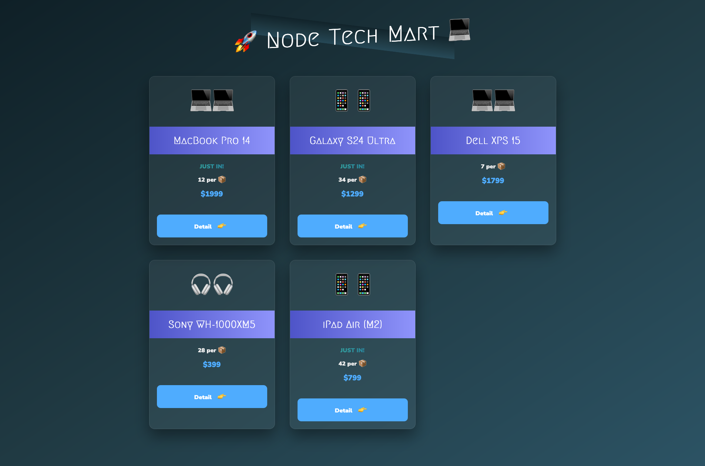

# 🚀 Node Tech Mart 💻

Node Tech Mart is a tech products catalog built with Node.js, Express.js, and EJS templating.
It features a clean, modern design with a focus on real-world web development skills like routing, templating, and dynamic data rendering.

## Demo Preview



---

## Tech Stack

- Node.js
- Express.js (built-in HTTP module used)
- EJS (HTML templating)
- HTML5, CSS3 (with a modern glassmorphism design)
- JSON (dynamic data source)

---

## Features

- Dynamic product listing (Overview Page)
- Detailed product view (Product Page)
- "New" badge for new arrivals
- Glassmorphism design with responsive grid layout
- Animated button hovers and subtle transitions
- Dark mode modern UI
- Modular project structure

---

## Project Structure

```
/data
  └── data.json               # Products data
/modules
  └── replaceTemplate.js      # Helper function to inject dynamic data
/templates
  ├── template-overview.html  # Overview page layout
  ├── template-card.html      # Individual product cards
  └── template-product.html   # Product detail page
/index.js                     # Server setup and routing
```

---

## 🚀 Getting Started

1. **Clone this repository:**

   ```bash
   git clone https://github.com/jeffgrahamcodes/node-tech-mart.git
   cd node-tech-mart
   ```

2. **Install dependencies:**

   ```bash
   npm install
   ```

3. **Start the development server:**

   ```bash
   npm start
   ```

4. **Open in your browser:**
   Visit `http://localhost:8000` to view the app.

---

## 📦 Future Improvements

- Add real product images instead of emojis
- Implement a real database (e.g., MongoDB or PostgreSQL)
- Add search and filter functionality
- Add cart functionality and checkout page
- Make the site fully responsive for mobile devices

---

## 🎯 Why This Project?

Node Tech Mart was built to showcase practical web development skills including server-side rendering, dynamic routing, and clean frontend presentation.
It is portfolio-ready for showcasing proficiency in backend and frontend integration.

---

## 🧑‍💻 Author

**Jeff Graham**
Web Developer | Cloud Consultant
🌐 [jeffgraham.codes](https://www.jeffgraham.codes)

---
